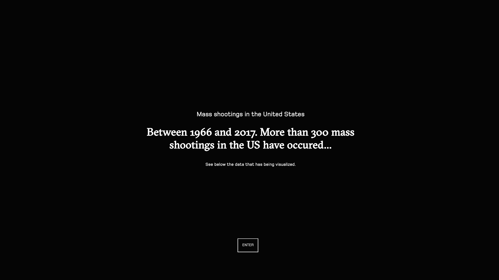

## ***Visualization about mass shootings in the US*** 🔫💀


## ***Short description***
This is part A of project Information Design that I've made about the mass shootings in the US.

---

## ***Background*** ℹ️
In this assignment I've created an interactive visualizations about the mass shootings in the US between 1966 and 2017. The user can see more information about the shooting and also can see how much of the shootings are done by race and which state it occured.

---

## ***Workflow*** 💪
* 📡 Finding the data.
* 📊 Display, displaying the data inside the chart(s).
* 🎬 Interactive, make the chart(s) interactive with events.
* 💡 Animate, make some elements look nicer.

---

## ***Concept*** 🤔
My Reasearch for Data subject didn't had datasets (yet!), sooo I needed to choose a news subject. I was looking on the internet and also the news and I was interested about the amount of mass shootings in the United States and what everyones reaction is about it.

After I chosen my subject I went to brainstorm about a couple of concepts and came with a concept for B and A:

__A:__ Visualizations that shows the general numbers of the mass shootings in the United States. You can scroll through the website to see the charts.

__B:__ More details about the shootings, where the shootings took place and a deeper inside to the suspect.

---

### ***Data*** #️⃣
The data I got from __[Kaggle](https://www.kaggle.com/carlosparadis/last-50-years-us-mass-shootings/data)__. Kaggle is a platform for predictive modelling and analytics competitions in which companies and researchers post data and statisticians and data miners compete to produce the best models for predicting and describing the data. The data contains a couple of columns which you can see below:
* __Title:__ title of the event.
* __Location:__ location of the event.
* __Date:__ date of the event.
* __Summary:__ summary of the event.
* __Fatalities:__ amount of fatalities.
* __Injured:__ amount of injured.
* __Total victims:__ total amount of victims.
* __Mental health issues:__ if the suspect has mental issues.
* __Race:__ what race the suspect is.
* __Gender:__ gender of the suspect.
* __Latitude:__ position of the event.
* __Longitude:__ position of the event.

#### ***Loading in the data*** 📡
I downloaded the `.csv` file and then looked into the file. The file looked like this:

##### ***Map data***
| Title | Location | Date | Summary | Fatalities | Injured | Total victims | Mental Health Issues | Race | Gender | Latitude | Longitude |
| ------------------------------------ | ---------------- | --------- | ------------------------------ | ---| --- | --- | ------- | ----- | ---- | --------- | ----------- |
| Las Vegas Strip mass shooting        | Las Vegas NV     | 10/1/2017 | Short description of the event | 58 | 527 | 585 | Unclear | White | Male | 36.181271 | -115.134132 |
| San Francisco UPS shooting           | San Francisco CA | 6/14/2017 | Short description of the event | 3  | 2   | 5   | Yes     | Asian | Male | 37.76559  | 122.406124  |  
| Pennsylvania supermarket shooting    | Tunkhannock PA   | 6/7/2017  | Short description of the event | 3  | 0   | 3   | Unclear | White | Male | 41.538688 | -75.946588  | 
| Florida awning manufacturer shooting | Orlando FL       | 6/5/2017  | Short description of the event | 5  | 0   | 5   | Unclear | White | Male | 28.538335 | -81.379236  | 
| Rural Ohio nursing home shooting     | Kirkersville OH  | 5/12/2017 | Short description of the event | 3  | 0   | 3   | Yes     | White | Male | 39.959508 | -82.595718  | 

##### ***Pie chart data***
| Race | Percentage |
| ------------- | ---- |
| Caucasian     | 44.7 |
| Afro American | 26.7 | 
| Latino’s      | 8.0  | 
| Asians        | 3.9  | 
| Other         | 2.6  |
| Unknown       | 9.9  |

##### ***Bubble chart data***
| id | value |
| ---------- | -- |
| Alabama    | 11 |
| Alaska     | 1  | 
| Arizona    | 13 | 
| Arkansas   | 2  | 
| California | 36 |

I really didn't needed to clean the data, so no kudo's for that 👎.

---

### ***Directory*** 📁
Here below you can see the directory:
                                              
    dev                                             # Main directory
    │── index.html                                  # Main file where everything is being loaded in
    │── data                                        # Directory for the data
    |   ├── data.csv                                # Data that is being used for the map
    |   ├── shootingsperrace.csv                    # Data that is being used for the pie chart
    |   └── shootingsperstate.csv                   # Data that is being used for the bubble chart
    |   
    |── src                                         # Directory for the css, js, fonts etc
    |   ├── css                                     # Directory for the css
    |   |   ├── index.css                           # Main css
    |   |   ├── font-awesome.min.css                # Fontawesome css
    |   |   └── reset.min.css                       # Reset css by Eric Meyer
    |   |     
    |   ├── fonts                                   # Main directory for the fonts
    |   |   ├── fontawesome-webfont.eot             # Fontawesome font
    |   |   ├── fontawesome-webfont.svg             # Fontawesome font
    |   |   ├── fontawesome-webfont.ttf             # Fontawesome font
    |   |   ├── fontawesome-webfont.woff            # Fontawesome font
    |   |   ├── fontawesome-webfont.woff2           # Fontawesome font
    |   |   └── FontAwesome.eot                     # Fontawesome font
    |   |
    |   └── js                                      # Directory fot the javascript
    |       ├── index.js                            # Main javascript
    |       ├── bubblechart.js                      # Javascript fot the bubble chart
    |       ├── map.js                              # Javascript for the map
    |       └── piechart.js                         # Javascript for the pie chart
    |
    └── README.md                                   # Readme.md

---

### ***Steps*** 🚶‍♂️
1. Started with the map 🗺️
I've first started with the map to show the locations where the mass shootings took place via dots. The dots give the size how many victims where killed. For the map I've used the following example from the __[bl.ocks](https://bl.ocks.org/mbostock/4090848)__. This is a basic map where the states have being rendered by an __[.JSON](https://d3js.org/us-10m.v1.json)__ file. Here below you can see basic code:

```javascript
svgMap.append("g")
    .attr("class", "states")
    .selectAll("path")
    .data(topojson.feature(us, us.objects.states).features)
    .enter().append("path")
    .attr("d", path);
// Append a path to the group object.
svgMap.append("path")
    // Give the path a classname.
    .attr("class", "state-borders")
    .attr("d", path(topojson.mesh(us, us.objects.states, function (a, b) {
        return a !== b;
    })));
```

I changed and added a couple of code to the map. The map didn't have any dots, so I added the following code to add dots to the map:

```javascript
// Select all the circles and link the data to it.
svgMap.selectAll("circle")
    .data(data)
    .enter()
    .append("circle")
    // Set the radius to the amount of fatalities.
    .attr("r", function (d) {
        return d.Fatalities;
    })
    // Set the cx of the circle the latitude where it is being located.
    .attr("cx", function (d) {
        //Use latitude as x-axis.
        return d.Latitude;
    })
    // Set the cx of the circle the longitude where it is being located.
    .attr("cy", function (d) {
        //Use longitude as y-axis.
        return d.Longitude;
    })
    // Give the circles a color.
    .style("fill", "pink")
```

You can see that I've already added some data to my dots. The dots have the coördinates included (the latitude and longitude!) and furthermore I set the size (radius) of the dots with the amount of fatalities that have been at the location. Now you can see the different sizes and the difference between the shootings at each location pinpointed on the map. I also changed the names per chart (which you can see at every piece of code that I will show), because if I kept them the same they won't show op the screen "but they will in the inspector!" - yes that's true, but we don't have a 💢🗯️⚠️ with the chart then do we? 🤓.

After alot of hours (seriously alot) I went to quit with the map. I could not continue on, because of the little time I had left for it, so I removed the map and begun to load the data into a bar chart.

So to the bar chart I've changed the x-axis a bit with a couple of CSS adjustments. Furthermore, I edited the x-axis text and gave it a rotation so that the text comes a lot nicer out of it.

```javascript
svgBar.append("g")
    .attr("transform", "translate(0," + height + ")")
    .call(d3.axisBottom(xBar))
    .selectAll("text")
    .style("text-anchor", "end")
    .attr("dx", "-.8em")
    .attr("dy", ".15em")
    .attr("transform", "rotate(-45)")
```

Also to the bars I've added a tooltip to it to make the data more specific and readable:

```javascript
on("mousemove", function (d) {
    tooltip
        .style("left", d3.event.pageX - 50 + "px")
        .style("top", d3.event.pageY - 70 + "px")
        .style("display", "inline-block")
        .html((d.Location) + "<br>" + (d.Fatalities) + " Fatalities");
    })
    // Mouseout event to remove the tooltip.
    .on("mouseout", function (d) {
        tooltip.style("display", "none");
    })
    // Give the bars a classname.
    .attr("class", "bar")
    .attr("x", function (d) {
        return xBar(d.Location);
    })
```

2. Started with the pie chart 🍰
After I've finished with the map I went to create the pie chart. I took the example from __[bl.ocks](https://bl.ocks.org/mbostock/3887235)__. In the pie chart I want to show the how much a mass shooting was executed by person sorted per race. So first of all I need to add different colors per race. I've added the following code to give per race a color:

```javascript
// Set range of colors for the pie chart.
var colorPie = d3.scaleOrdinal()
    .range(["#E0E4CC", "#D6DAC2", "#7BB0A6", "#7BB0A6", "#92F22A", "#64DDBB"])
```

to this:

```javascript
var colorPie = d3.scaleOrdinal()
    .range(["rgba(183, 61, 55, 1)", "rgba(183, 61, 55, 0.75)", "rgba(183, 61, 55, 0.50)", "rgba(183, 61, 55, 0.25)", "#202020", "#666666"])
```

I changed the colors to more fancy colors that suits to my concept and subject.

To make the pie chart a bit more different I changed and added a bit of code. First I added a circle in the middle of the piie chart to make it look like an donut chart (I know I just could've used and donut chart as a chart, but hey!). The code I added a circle is shown below:

```javascript
gPie.append("circle")
    .attr("cx", 0)
    .attr("cy", 0)
    .attr("r", 200)
    .attr("fill", "#050505");
```

As extra to the pie chart I also removed the current labels inside the pie chart and added new code as a legend, which you can see below:

```javascript
var legend = svgPie.selectAll(".legend")
    .data(pie(data))
    .enter()
    .append("g")
    .attr("transform", function (d, i) {
        return "translate(" + (width - 950) + "," + (i * 30 + -80) + ")"; // place each legend on the right and bump each one down 15 pixels
    })
    .attr("class", "legend");
    
    legend
        .append("rect")
        .attr("width", 20)
        .attr("height", 20)
        .attr("y", 5)
        .attr("x", -35)
        .attr("fill", function (d, i) {
            return colorPie(i);
    });
    
    legend
        .append("text")
        .style("font-size", 18)
        .attr("y", 10)
        .attr("x", 11)
        .text(function (d) {
            return d.data.Race + ": " + "" + d.data.Percentage + "%";
    });
```

The legend I've added I used this from __[one of my previous assessments](https://dylanvanzanten.github.io/fe3-assessment-3/)__ for the subject Frontend3. The race and percentage are returned in the text. 


3. Started with the bubble chart 👐
With the bubble chart I wanted to show the amount of how many mass shootings where in which state. First of I cleaned the code up a bit and removed the stuff I don't need really. After that I've made a own color scale to the bubble chart, which you can see below:

```javascript
.style("fill", function (d) {
    if (d.value <= 5) {
        return "rgba(183, 61, 55, 0.25)"
    } else if (d.value <= 10) {
        return "rgba(183, 61, 55, 0.50)"
    } else if (d.value <= 15) {
        return "rgba(183, 61, 55, 0.75)"
    } else {
        return "rgba(183, 61, 55, 1)"
    }
})
```

I've made an if and else statements that checks if the data has a certain amount. If the data amount is true it gets that color assigned to it. Also I've added a simple transition to the bubbles and text in combination with a ease:

```javascript
transition()
    .delay(1000)
    .ease(d3.easeElasticOut)
    .attr("r", function (d) {
        return d.r;
    })
    .duration(2000);
```

4. Put all the charts into the page
After I added the charts I then went to place all the charts into the main page. To I linked al the Javascript files into the index.html file. When I've done that I only saw one chart, but in the inspector they did show the data. After some time I finally figured it out: I had to change the main things inside a chart. So for example:

```javascript
var svg = d3.select(".svgBar")
```
to
```javascript
var svgBar = d3.select(".svgBar")
```

Now it has a unique name and it cannot be interrupted bij other charts.

5. Adding text to support the charts 📝
I've added some sentences to support the charts.

6. Adding style & place the charts 👔
So now when I've done all the charts I went to focus on the styling of the page. First I set up the `index.html` correctly (so that it's semantic correct (emoji)). I used most HTML5 coding to setup the page.

The page directory is like this:

    body                                               # The body
    │── header                                         # Header for the intro
    │    ├── div                                       # Div
    │    │    ├── h4                                   # h4 text
    │    │    ├── h1                                   # h1 text
    │    │    └── h6                                   # h6 text
    │    │
    │    └── button
    │                              
    └── main                                           # Main (container)
        └── section                                    # Section (container for the charts)
            ├── h1                                     # h1 text
            └── svg                                    # The chart             

I seperated each chart into a `<section>` that is looks like this:

```html
<section>
    <h1>Most recent shootings in the US</h1>
    <p>Below here you can see the amount of people that have been killed by most recent "Mass shootings". You can hover on the bars to see the information more specified.</p>
    <svg class="svgBar"></svg>
</section>
<section>
    <h1>Total mass shootings per race</h1>
    <p>In this chart you can see how much percentage of a race that has been accused of "Mass shootings".</p>
    <svg class="svgPie"></svg>
</section>
<section>
    <h1>Total mass shootings per state</h1>
    <p>Here you can see how much "Mass shootings" per states there have been</p>
    <svg class="svgBubble"></svg>
</section>
```

I've added the following style to the `section`:

```css
section {
    height: 100vh;
    flex-direction: column;
    align-items: center;
    justify-content: center;
    display: flex;
    padding: 2rem;
}
```

Each chart has is own section, so it's better to see them as a seperate chart. Also each section has is own supporting text to show what the user can see and can do. 

---

## ***Thoughts*** 💭
I'm not really happy with the overall result. The main thing (the map) didn't worked so I had to made a solution for it. It is really a shame that I didn't had a lot of time to make something cool and unique. Maybe that can be a feedback for the teacher who worked on this project.

---

## ***Things that can lift up the quality and usability*** 🏆
* Adding more interactivity to the pie and bubble chart by seeing a animation when you reach the section when you scroll.
* Add a slider to see per year a mass shooting.
* A more interactive map with more data to add.
* Could've used more of the data.
* Add a script to show the chart on scroll.

---

## ***Features***
* __[D3](https://d3js.org/)__
* __[D3 .csv](https://github.com/d3/d3/wiki/CSV)__
* __[D3 transition](https://github.com/d3/d3-transition/blob/master/README.md#transition)__
* __[D3 select](https://github.com/d3/d3-selection/blob/master/README.md#select)__
* __[D3 selectAll](https://github.com/d3/d3-selection/blob/master/README.md#selectAll)__
* __[Selection append](https://github.com/d3/d3-selection/blob/master/README.md#selection_append)__
* __[Selection attr](https://github.com/d3/d3-selection/blob/master/README.md#selection_attr)__
* __[Selection enter](https://github.com/d3/d3-selection/blob/master/README.md#selection_enter)__

## ***Sources***
* __[Data from Kaggle](https://www.kaggle.com/carlosparadis/last-50-years-us-mass-shootings/data)__
* __[Author](https://b.locks.org/mbostock)__
* __[Map](https://bl.ocks.org/mbostock/4090848)__
* __[Simple Bar Chart](https://bl.ocks.org/mbostock/3885304)__
* __[Simple Pie Chart](https://bl.ocks.org/mbostock/3887235)__
* __[Bubble chart](https://bl.ocks.org/mbostock/3887235)__
* __[Bubble chart tutorial](https://www.youtube.com/watch?v=gda35eYXBJc&t=15)__
* __[Let's make a Pie Chart with D3.js](http://www.cagrimmett.com/til/2016/08/19/d3-pie-chart.html)__
* __[Simple tooltip in d3.v4](https://bl.ocks.org/d3noob/257c360b3650b9f0a52dd8257d7a2d73)__
* __[Axis labels in d3.v4](https://bl.ocks.org/d3noob/23e42c8f67210ac6c678db2cd07a747e)__
* __[D3js set x-axis tick position](https://stackoverflow.com/questions/43840134/d3js-set-x-axis-tick-position)__
* __[Show/ hide elements on mouse click](http://bl.ocks.org/d3noob/5d621a60e2d1d02086bf)__
* __[Add a transition to a D3 scatterplot](https://stackoverflow.com/questions/27950920/add-a-transition-to-a-d3j-scatter-plot)__
* __[How to add a nice legend to a d3 pie chart](https://stackoverflow.com/questions/32298837/how-to-add-a-nice-legend-to-a-d3-pie-chart)__

---

## ***License***
All the rights go to __[Mike Bostock](https://b.locks.org/mbostock)__ and __[D3](https://d3js.org/)__. And also al rights to __[Kaggle](https://www.kaggle.com/carlosparadis/last-50-years-us-mass-shootings/data)__ for the data that I've being using.

---

MIT © Dylan van Zanten